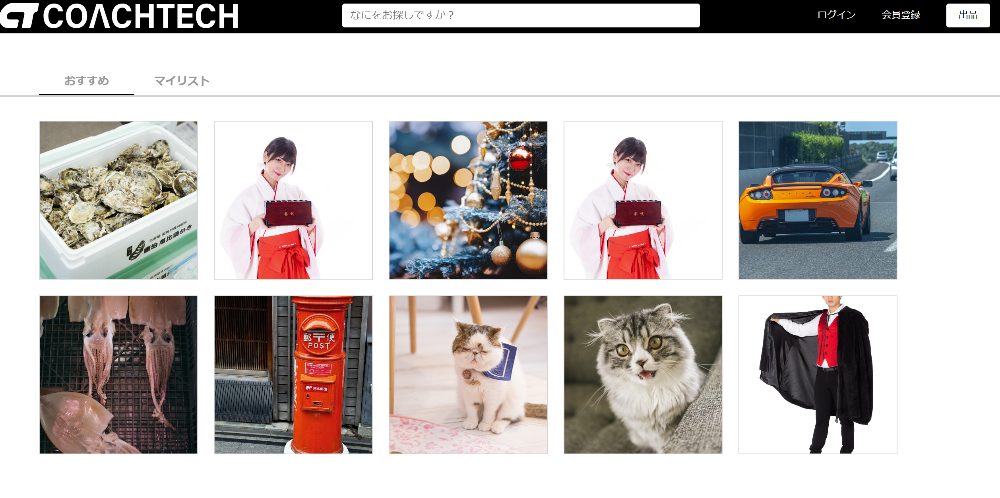
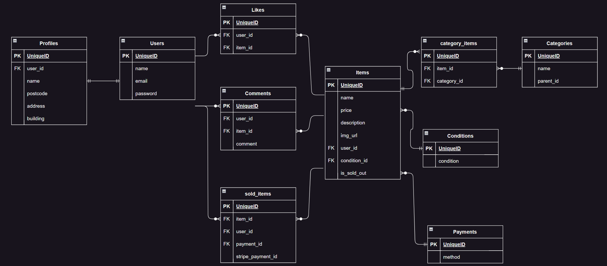

<div id="top"></div>

## 使用技術一覧
<p style="display: inline">
  <!-- フロントエンドのフレームワーク一覧 -->

  <!-- バックエンドのフレームワーク一覧 -->
  
  <!-- バックエンドの言語一覧 -->
 
  <!-- ミドルウェア一覧 -->
 
  <!-- インフラ一覧 -->

</p>

## サービス名

coachtechフリマ

## サービスについて

coachtechブランドのアイテムを出品する、ある企業が開発した独自のフリマアプリ  

アプリケーションURL: http://localhost  
phpMyAdmin URL: http://localhost:8080  

  

## 環境

<!-- 言語、フレームワーク、ミドルウェア、インフラの一覧とバージョンを記載 -->

| 言語・フレームワーク        | バージョン  |
| ------------------------- | ---------- |
| Laravel Framework 8.83.8  | 3.11.4     |
| PHP                       | 8.1.2      |
| stripe/stripe-php         | * v9.9.0   |
| Docker                    | 27.2.0     |

その他のパッケージのバージョンは package.json を参照してください

## 機能一覧  
ログイン機能、メール認証、商品の閲覧、商品検索、商品の出品、商品の購入

【ログイン後】  
お気に入り追加/削除、商品へのコメント投稿/削除、プロフィール変更、商品出品、購入

## 使用技術
フロントエンドのフレームワーク: Javascript  
バックエンドのフレームワーク:  Laravel  
バックエンドの言語: PHP  
ミドルウェア: laravel-fortify, Stripe  
インフラ: Docker  

## テーブル設計及びER図


## 開発環境構築

## 1. リポジトリのクローンとDocker起動
### クローン
```
$ git clone https://github.com/aizawamisa/flea.git
```

### Docker起動
```
$ docker compose up -d --build
```

### phpコンテナに入る
```
$docker compose exec php bash
```

## 2. Composerのインストール
```
$ composer install
```

## 3. .envの作成、環境設定の記述
```
$ cp .env.local .env
```

## 4. アプリケーションキー作成
```
$ php artisan key:generate
```

## 5. データベースの設定
```
$ php artisan migrate --seed
```

## 6. シンボリックリンクの作成
```
$ php artisan storage:link
```

## 7. ディレクトリ権限の変更
```
$ sudo chmod -R 775 storage  
$ sudo chmod -R 775 bootstrap/cache
```

## 8. CSS を変更する場合、npmのインストール
```
$ npm install  
$ npm run watch
```

### ダミーデータの説明
ログインメール : test@test.com  
パスワード：password  

